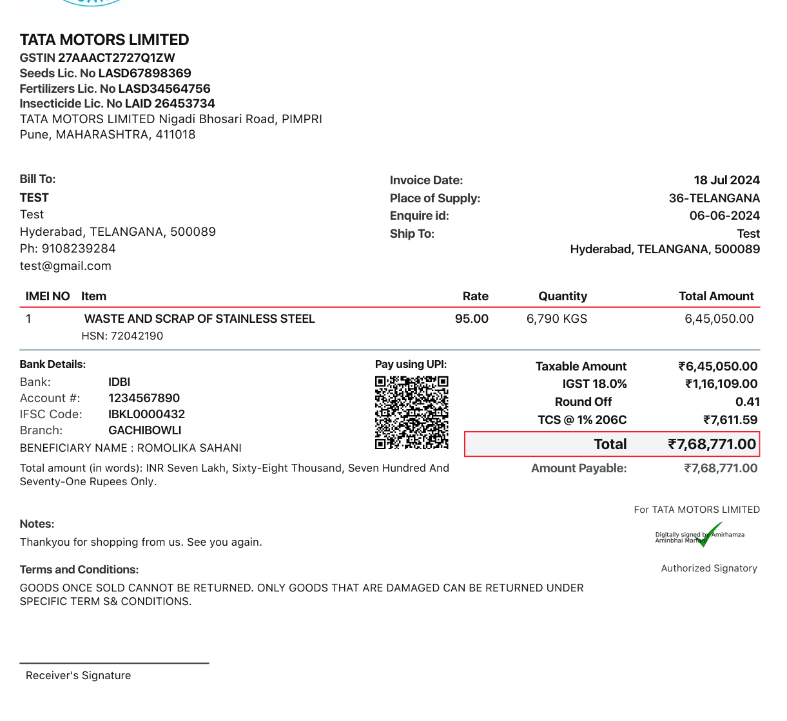
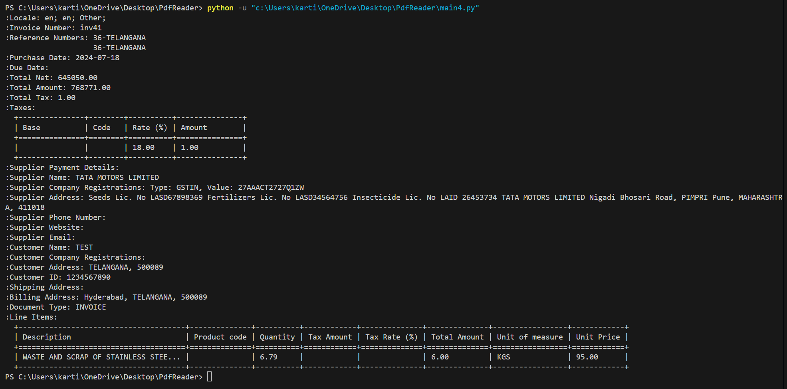

# Invoice Reader with Mindee API

## Overview

This project uses the Mindee API to extract structured data from invoice documents. The provided Python script loads an invoice PDF file, sends it to Mindee's API for parsing, and retrieves key information such as the sender, receiver, total amount, and date.

## Requirements

- Python 3.6 or higher
- Mindee Python library

## Installation

1. **Install Python:**

   Ensure Python 3.6 or higher is installed on your system. You can download it from [python.org](https://www.python.org/downloads/).

2. **Install Required Libraries:**

   Install the Mindee Python library using pip:

   ```bash
   pip install mindee

## example
###Invoice 



### result

